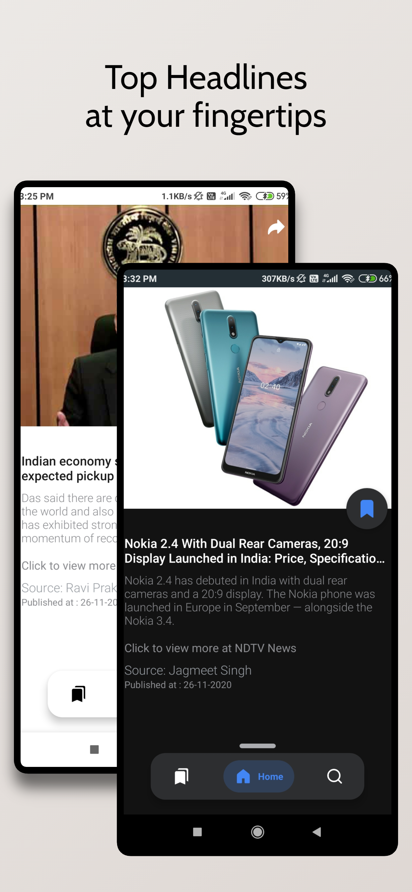
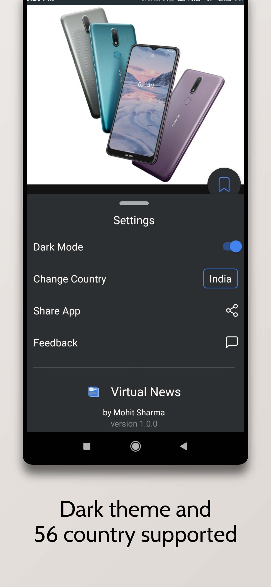
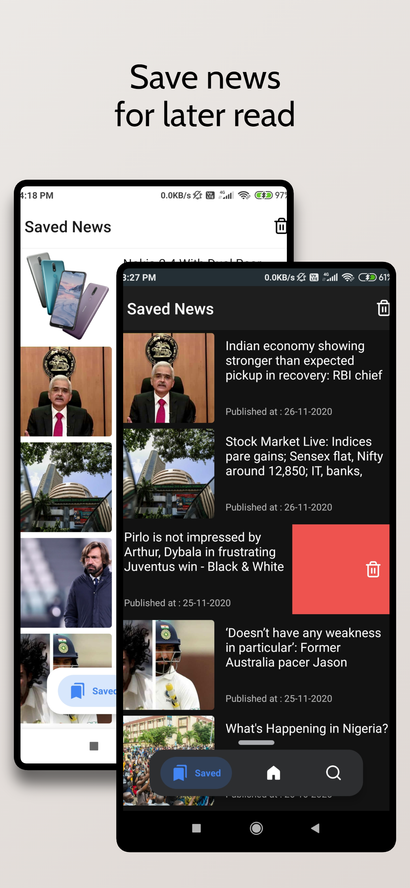
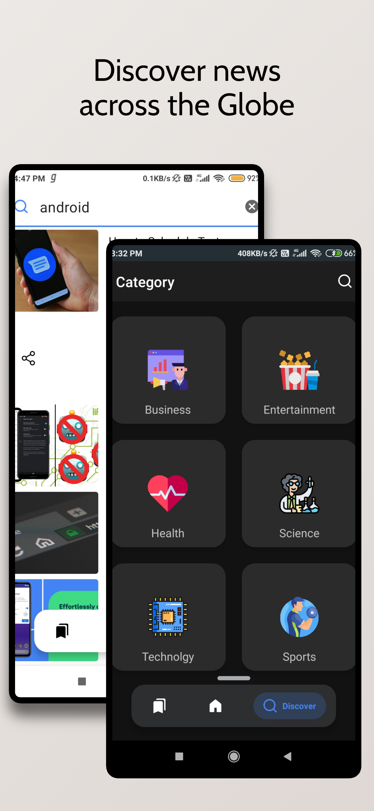

# Virtual News
The goal is to create a News Feed app which gives a user regularly-updated news from the internet 
related to a particular topic, person, or location.
Powered by [News Api](https://newsapi.org). 

### Features

* Enhanched UI/UX with Dark mode
* Search news all over the world
* Get Country specific news from 56 Countries and languages
* Get News from 6 differnet Categories like Sports,Science..etc
* Save News for Later read

### Preview
 
 
